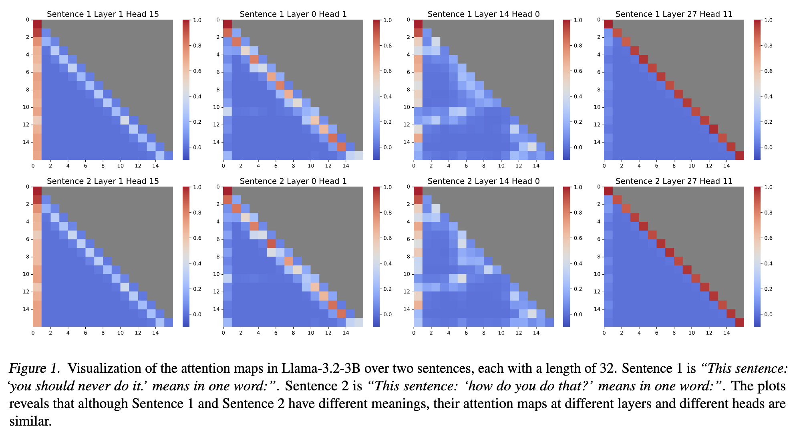

# AttnCache: Accelerating Self-Attention Inference on Big Memory Systems Using Attention Cache



## Usage

## Transformer Decoder (Llama)


### Environment Setup

```
conda create -n AttnCache python=3.9
conda activate AttnCache

pip install torch torchvision torchaudio
pip install transformers==4.50.3 accelerate datasets scikit-learn scipy matplotlib faiss-cpu
```

### Download MMLU dataset

```
wget https://people.eecs.berkeley.edu/~hendrycks/data.tar

tar -xf data.tar 
```

### Collect Hidden States and Attention Maps 
Run the following command to load the pre-trained BERT model from the `./trained_bert_sst2` directory, collect Hidden States and Attention Maps, and save them in `./BertDB`. 

```
python collect_hs_apms.py \
        --dataset sst2 \
        --model-path ./trained_bert_sst2 \
        --save-dir ./BertDB 
```


### Train Feature Projector and Build Index DB


```
python train_fp_and_build_db.py --save-dir ./BertDB
```
## Evaluation
```
python test.py --threshold 0.995
```


<!-- ## Citation

If you find AttnCache useful or relevant to your project and research, please kindly cite our paper:

```bibtex
@article{xiao2023streamingllm,
        title={Efficient Streaming Language Models with Attention Sinks},
        author={Xiao, Guangxuan and Tian, Yuandong and Chen, Beidi and Han, Song and Lewis, Mike},
        journal={arXiv},
        year={2023}
        }
``` -->


